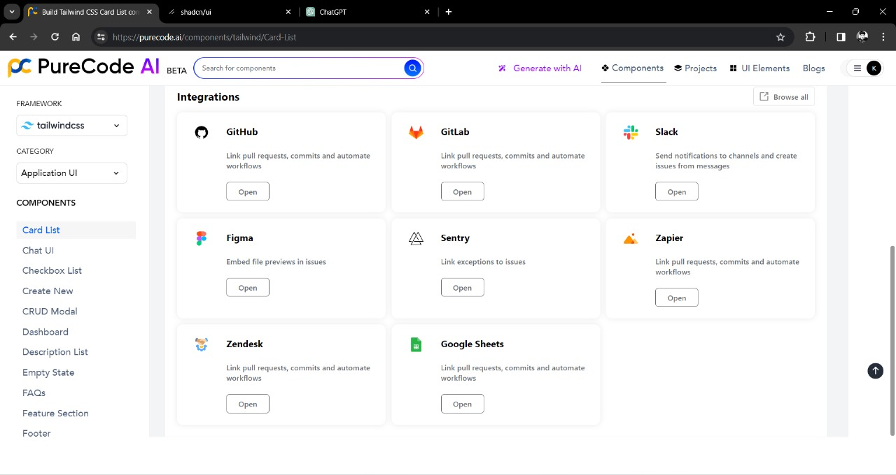
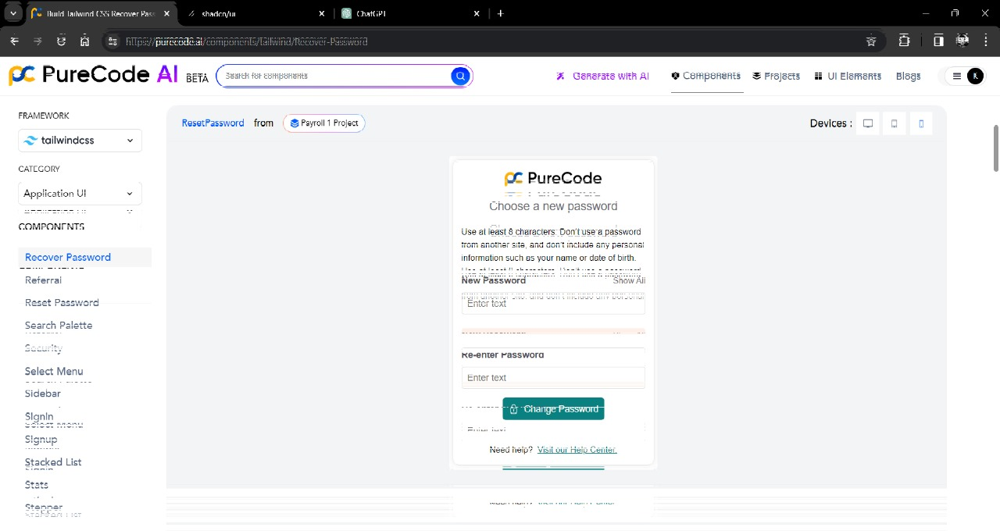

# Assessment Report

## Thoughts and Impressions

### Diverse Component Library
The inclusion of real-life scenario components adds depth and versatility to the library.


### Customizability
Easily customizable components with the ability to style as required.


### Responsive Design
The focus on responsive components is crucial for ensuring a consistent and user-friendly experience across different devices.


### Robust Structure
All components are robust and organized in a good folder structure.

### AI Component Generation
The AI prompt to generate components is a great feature, providing customization for different components.


## Bugs or Ways to Improve

### Bug: Preview not Appearing
While generating a new component using the AI prompt, the preview or canvas view is not appearing.


### Dependency Concerns
Instead of making it a Component Library dependent on large packages like Material UI, consider a collection of reusable components that users can easily copy and paste.

### Framework Support
Provide support for every framework that supports React, including Next.js, Astro, Remix, and Gatsby.

### CLI Tool
Consider developing a CLI tool that can automatically copy-paste components into the user's current project. It may have following commands :
## Project Initialization using CLI tool 

To initialize your project and install dependencies using `purecode-ui`, use the following command:

```bash
npx purecode-ui@latest init
```
## Usage

```bash
npx purecode-ui@latest init [options]
```

### Options

initialize your project and install dependencies

- `-y, --yes`: Skip confirmation prompt. (Default: false)

- `-c, --cwd <cwd>`: The working directory. Defaults to the current directory.

- `-h, --help`: Display help for command.

Example:

```bash
npx purecode-ui@latest init -y -c /path/to/your/project
```

## Add Component

To add components to your project using `purecode-ui`, use the following command:

```bash
npx purecode-ui@latest add [component]
```

## Selecting Components

**Which components would you like to add?**
- Space to select.
- A to toggle all.
- Enter to submit.

◯  accordion

◯  alert

◯  alert-dialog

◯  aspect-ratio

◯  avatar

◯  badge

◯  button

◯  calendar

◯  card

◯  checkbox

Choose the components you'd like to add by selecting them and pressing Enter.

Example:

```bash
npx purecode-ui@latest add button
```

### Documentation
Ensure comprehensive and easy-to-understand documentation for each component to facilitate smooth integration into projects.


## New Feature Ideas and Additions

### Typescript Support
Adding Typescript support can elevate the Component Library, making it among the top UI Libraries.


### Predefined Themes
Introduce support for predefined themes, offering users a quick and easy way to apply consistent styling.


### Live Preview
Implement a feature allowing users to see live previews of components before integrating them into their projects.

### Redesigned Website
Consider redesigning the website to include tabs or sections showcasing examples of websites/pages built using these components.


### Interactive Demos
Include interactive demos for each UI component, enabling users to experiment with customization options in real-time.


---
